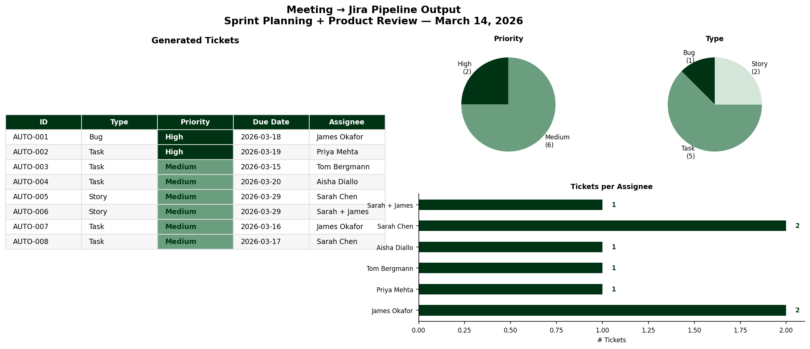

# Meeting to Jira Pipeline

**Automated extraction, classification, and ticket generation from raw meeting transcripts**

---

## [ 01. THE PROBLEM ]

After every sprint planning or product review meeting, someone has to manually read through the transcript or notes, identify every action item, figure out who owns it, decide how urgent it is, and create a Jira ticket for each one.

For a 52-minute meeting with 5 attendees, that process takes 20-40 minutes and produces inconsistent results depending on who does it. Action items get missed. Priorities are inconsistent. Tickets lack context.

This pipeline eliminates that work entirely.

---

## [ 02. WHAT IT DOES ]

The pipeline takes a raw meeting transcript as input and outputs a set of structured, Jira-ready tickets in JSON format -- plus a visual summary for review.

**Input:** A plain text meeting transcript (`meeting_transcript.txt`)

**Output:**
- `jira_tickets_output.json` -- structured tickets ready for Jira API import
- `outputs/pipeline_summary.png` -- visual summary of all tickets, priorities, and assignees

**Each ticket includes:**
- Unique ticket ID (`AUTO-001`, `AUTO-002`, etc.)
- Issue type (Bug, Task, Story)
- Priority (High, Medium, Low) -- based on keyword signal detection
- Assignee(s) with role and Jira user ID
- Due date -- calculated from natural language references ("by Wednesday EOD", "end of next week")
- Context -- the relevant discussion from the meeting that generated this ticket
- Labels for traceability (`auto-generated`, `sprint-planning`, meeting date)

---

## [ 03. PIPELINE ARCHITECTURE ]

```
meeting_transcript.txt
         |
         v
[ Stage 1: Ingestion ]
  Read transcript text

         |
         v
[ Stage 2: Action Extraction ]
  Parse ACTION ITEMS RECAP section
  (Production: LLM API call to extract from full transcript)

         |
         v
[ Stage 3: Classification ]
  detect_ticket_type()  -- Bug / Task / Story / Automation / Release
  detect_priority()     -- High / Medium / Low via keyword signals
  extract_assignees()   -- maps names to Jira user IDs
  parse_due_date()      -- converts natural language to ISO date

         |
         v
[ Stage 4: Output ]
  jira_tickets_output.json  -- structured Jira-ready tickets
  outputs/pipeline_summary.png  -- visual summary chart
```

---

## [ 04. SAMPLE OUTPUT ]

**Source meeting:** Sprint Planning + Product Review, March 14 2026
**Attendees:** Sarah Chen (Product), James Okafor (Engineering), Priya Mehta (QA), Tom Bergmann (CS), Aisha Diallo (Design)
**Duration:** 52 minutes



**8 tickets generated in under 1 second:**

| Ticket | Type | Priority | Assignee | Due |
|---|---|---|---|---|
| AUTO-001 | Bug | **High** | James Okafor | Wed after meeting |
| AUTO-002 | Task | **High** | Priya Mehta | Thu after meeting |
| AUTO-003 | Task | Medium | Tom Bergmann | Same day |
| AUTO-004 | Task | Medium | Aisha Diallo | Fri after meeting |
| AUTO-005 | Story | Medium | Sarah Chen | 2 weeks out |
| AUTO-006 | Story | Medium | Sarah + James | 2 weeks out |
| AUTO-007 | Task | Medium | James Okafor | Mon after meeting |
| AUTO-008 | Task | Medium | Sarah Chen | Tue after meeting |
```

And directly above the table, change the line that reads:
```
**8 tickets generated in under 1 second:**
```

To:
```
**8 tickets generated in under 1 second. Due dates calculated dynamically from meeting date:**

---

## [ 05. SAMPLE JSON TICKET ]

```json
{
  "ticket_id": "AUTO-001",
  "summary": "Fix CSV export truncation bug, staging by Wednesday EOD",
  "issue_type": "Bug",
  "priority": "High",
  "status": "To Do",
  "assignees": [
    {
      "name": "James Okafor",
      "role": "Engineering Lead",
      "jira_id": "james.okafor"
    }
  ],
  "due_date": "2026-03-18",
  "context": "Three enterprise clients affected: Harlow Logistics, Meridian Technologies, Northgate Financial. Fields truncated at 256 chars. Legacy export handler issue.",
  "labels": ["auto-generated", "sprint-planning", "meeting-2026-03-14"],
  "source": "Sprint Planning + Product Review — March 14 2026"
}
```

---

## [ 06. HOW TO RUN ]

```bash
# Install dependencies
pip install matplotlib

# Run the pipeline
python pipeline.py

# Output files will appear in:
#   jira_tickets_output.json
#   outputs/pipeline_summary.png
```

Or run interactively in Google Colab -- no local setup required.

---

## [ 07. DESIGN DECISIONS ]

**Why rule-based classification instead of a direct LLM call?**
The classification logic (ticket type, priority, assignee, due date) is deterministic and testable. Rule-based signals produce consistent, auditable results and require no API dependency or cost to run. This makes the pipeline reliable in CI/CD environments and easy to extend.

**Where an LLM fits in production:**
The action extraction step -- parsing a full unstructured transcript to identify action items -- is where an LLM API call (e.g. Claude) adds the most value. In production, Stage 2 would send the full transcript to Claude with a structured extraction prompt, receive JSON back, and feed it into the same classification pipeline. That swap is a single function replacement.

**Why include context in every ticket?**
Jira tickets without context create follow-up questions. Including the relevant discussion excerpt means assignees have everything they need without re-reading the transcript.

**Natural language due dates:**
Meeting participants say "by Wednesday EOD" and "end of next week" -- not ISO dates. The `parse_due_date()` function converts these to real dates relative to the meeting date, which is what Jira's API expects.

---

## [ 08. WHAT I WOULD BUILD NEXT ]

- **Stage 2 LLM integration:** Replace the manual action list with a Claude API call that parses the full transcript automatically. The prompt is designed and documented -- the integration is a single function swap.
- **Jira API write:** Add a `POST /rest/api/3/issue` call to push tickets directly into a live Jira board rather than exporting JSON.
- **Zendesk trigger:** Connect this pipeline to a Zendesk webhook so that tickets above a severity threshold are automatically routed into Jira without any manual copy-paste.
- **Slack notification:** Post the generated ticket summary to the relevant Slack channel immediately after the meeting ends.
- **Confidence scoring:** Flag tickets where the classification confidence is low for human review before they are written to Jira.

---

**Status:** Functional / Documented
**Stack:** Python, JSON, Matplotlib
**Author:** Mohamed Bah | [LinkedIn](https://www.linkedin.com/in/bah-007700/) | [GitHub](https://github.com/Moezusb)
