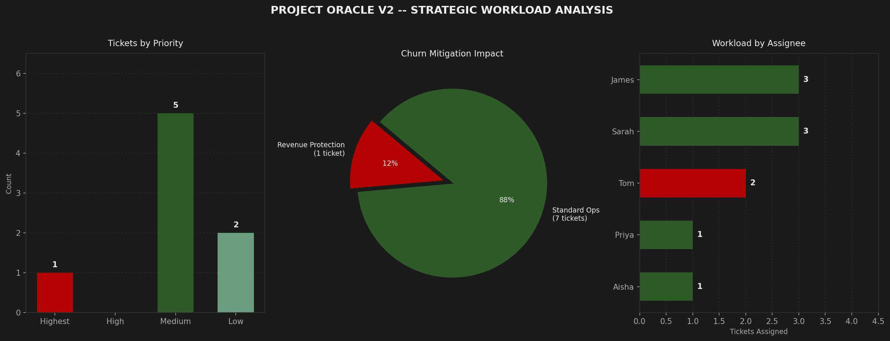

# Project Oracle V2: Revenue-Aware Action Engine

**Converts raw meeting transcripts into validated, revenue-prioritized Jira tickets -- automatically escalating priority when at-risk enterprise clients are on the line.**

---

## The Problem

Standard meeting summaries fail because they strip business context.

A bug flagged in a sprint call might be classified as "Medium" priority by a keyword-matching tool. But if that bug is actively blocking a $120k enterprise client from running their weekly reports -- a client already showing churn signals -- it is not Medium. It is a drop-everything issue.

Project Oracle V2 closes that gap. It adds a **Revenue Intelligence Gate** to the extraction pipeline: every ticket is cross-referenced against a live database of high-value client health scores before it ever reaches the backlog.

---

## What It Does

| Step | Module | Output |
|:--|:--|:--|
| 1. Parse | `transcript_parser.py` | Structured action items from raw transcript |
| 2. Classify | `pipeline_v2.py` | Issue type, base priority, labels, due dates |
| 3. Enrich | Revenue Intelligence Gate | Client health cross-reference, ARR lookup |
| 4. Escalate | Revenue Intelligence Gate | Priority override for At-Risk and Watch accounts |
| 5. Validate | `models.py` (Pydantic) | Schema enforcement before export |
| 6. Visualize | `v2_dashboard.py` | Three-panel strategic workload dashboard |

---

## Architecture

```
meeting_transcript.txt
        │
        ▼
transcript_parser.py        ← Rule-based extraction layer
        │                      In production: replaced by a single Claude API call
        ▼
pipeline_v2.py              ← Classification engine + Revenue Intelligence Gate
        │
        ├── high_value_clients.json   ← Revenue Bridge (CRM export)
        │
        ▼
models.py                   ← Pydantic schema enforcement
        │
        ▼
jira_v2_production_ready.json
        │
        ▼
v2_dashboard.py             ← Strategic visualization
        │
        ▼
outputs/v2_strategic_summary.png
```

---

## Revenue Intelligence Gate

The key differentiator in V2. After base classification, the pipeline scans each ticket against a structured high-value client database pulled from the Revenue Bridge.

| Client Health | Pipeline Action |
|:--|:--|
| **At-Risk** | Priority overridden to `Highest` · Label `REVENUE-AT-RISK` appended |
| **Watch** | Priority raised to `High` if not already escalated |
| **Healthy** | No change |

This mirrors how an experienced operations lead actually reads the room. The same bug is a different issue depending on who it affects. A keyword list breaks the moment a client is renamed. A structured Revenue Bridge updates automatically when the CRM does.

---

## Sample Output

```
============================================================
  PROJECT ORACLE V2 -- REVENUE-AWARE ACTION ENGINE
============================================================

[1/4] Parsing transcript: meeting_transcript.txt
  Extracted 8 action items.

[2/4] Building and classifying tickets...
  8 tickets classified.

[3/4] Loading Revenue Bridge: high_value_clients.json
  5 high-value clients loaded.
  [ESCALATED] AUTO-003 -- Harlow Logistics (At-Risk) -> Highest
  Revenue escalations: 1

[4/4] Validating schema and exporting...

============================================================
  PIPELINE COMPLETE
  Tickets validated : 8
  Schema errors     : 0
  Revenue escalated : 1
  Output            : jira_v2_production_ready.json
============================================================

  ARR at risk across escalated tickets: $120,000

ID         Priority   Type     Assignee          Due          Summary
------------------------------------------------------------------------
AUTO-001   Medium     Bug      James             2026-03-18   Fix CSV export truncation bug
AUTO-002   Medium     Bug      Priya             2026-03-19   Regression testing on export module
AUTO-003   Highest    Task     Tom               2026-03-14   Send holding message to Harlow Logistics [REVENUE]
AUTO-004   Medium     Story    Aisha             2026-03-20   Finalize onboarding designs
AUTO-005   Low        Story    Sarah, Tom        2026-03-21   Build Confluence auto-population automation
AUTO-006   Low        Story    Sarah, James      2026-03-28   Spec Zendesk-to-Jira severity integration
AUTO-007   Medium     Task     James             2026-03-16   Technical changelog for v2.4
AUTO-008   Medium     Task     Sarah             2026-03-17   Client-facing release notes
```
### Strategic Dashboard


---

## How to Run

**GitHub Codespaces (recommended)**

```bash
pip install -r requirements.txt
python pipeline_v2.py
python v2_dashboard.py
```

**Google Colab**

```python
!pip install -r requirements.txt
!python pipeline_v2.py
!python v2_dashboard.py

from IPython.display import Image
Image("outputs/v2_strategic_summary.png")
```

The dashboard renders as `outputs/v2_strategic_summary.png` -- three panels showing ticket priority distribution, revenue protection vs. standard ops split, and workload by assignee.

---

## Design Decisions

**Why rule-based extraction instead of a direct API call?**
`transcript_parser.py` is an intentional demonstration of the extraction logic a production LLM call would replace. It makes the architecture legible and lets the pipeline run without an API key. The tradeoff is explicit in the code comments.

**Why Pydantic for schema enforcement?**
Jira's API fails silently on malformed tickets. Running validation at the Python layer before export means every error is caught, surfaced with context, and debuggable. Zero schema errors in the output means zero sync failures in production.

**Why a Revenue Bridge instead of keyword matching?**
A hardcoded list of client names breaks the moment a client is renamed, acquired, or added. A structured JSON database -- standing in for a live CRM export -- means escalation logic stays accurate as the business changes.

**Why separate pipeline and dashboard scripts?**
The pipeline is designed to run headless in CI or scheduled jobs. The dashboard is an optional reporting layer that reads the JSON output independently. Keeping them separate means either can be swapped without touching the other.

---

## What I Would Build Next

- Replace `transcript_parser.py` with a Claude API call capable of handling transcripts without a formal recap section
- Pull `high_value_clients.json` from a live CRM export via Salesforce or HubSpot API
- Add a direct Jira API integration to push validated tickets without the JSON intermediate step
- Trigger a Slack alert on any `REVENUE-AT-RISK` escalation so the CS team is notified in real time

---

**Stack:** Python · Pydantic · Matplotlib · Pandas · JSON  
**Author:** Mohamed Bah  
**Status:** Production-grade · Codespaces-ready
